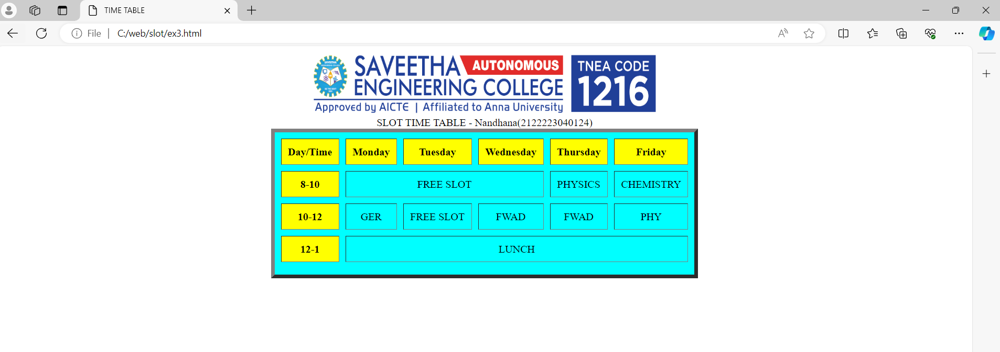

# Ex03 Time Table
## Date:

## AIM
To write a html webpage page to display your slot timetable.

## ALGORITHM
### STEP 1
Create a Django-admin Interface.

### STEP 2
Create a static folder and inert HTML code.

### STEP 3
Create a simple table using ```<table>``` tag in html.

### STEP 4
Add header row using ```<th>``` tag.

### STEP 5
Add your timetable using ```<td>``` tag.

### STEP 6
Execute the program using runserver command.

## PROGRAM
<html>
   <title> TIME TABLE </title>
   <body>
   <center>
   
<table border="6" bgcolor="cyan" cellspacing="10" cellpadding="10">
<caption> SLOT TIME TABLE -  Nandhana(2122223040124) </caption>

<tr bgcolor="yellow">
     <th> Day/Time </th>
     <th> Monday </th>
     <th> Tuesday </th>
     <th> Wednesday </th>
     <th> Thursday </th>
     <th> Friday </th> 
</tr>
<tr align="center">
   <th bgcolor="yellow"> 8-10 </th>
   <td colspan="3"> FREE SLOT</td>
   <td> PHYSICS </td>
   <td> CHEMISTRY </td>
</tr>
<tr align="center">
    <th bgcolor="yellow"> 10-12 </th>
    <td> GER </td>
    <td> FREE SLOT </td>
    <td> FWAD </td>
    <td> FWAD </td>
    <td> PHY </td>
</tr>
<tr align ="center">
    <th bgcolor="yellow"> 12-1 </th>
    <td colspan="5" align="center"> LUNCH </td>
</tr>
<tr align ="center">
    <th bgcolor="yell
    nandy-nan
    nandhana.r

## OUTPUT



## RESULT
The program for creating slot timetable using basic HTML tags is executed successfully.
